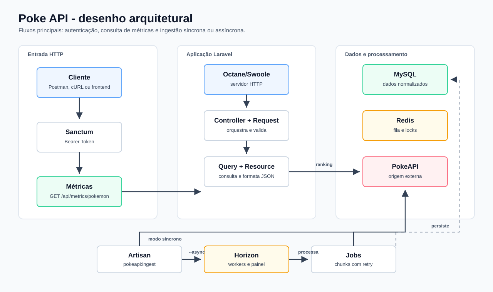
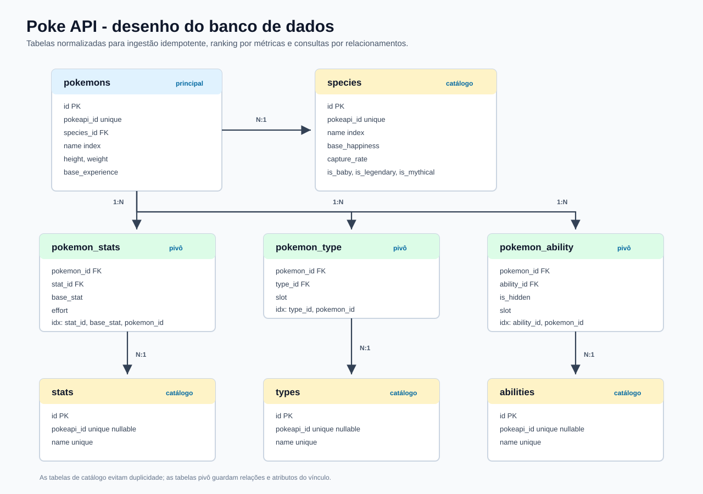

# Poke API

API Laravel para ingestão de dados da PokeAPI e consulta autenticada de rankings de métricas dos Pokémon.

## Sumário

- [Instruções de execução](teste-pratico.md)
- [Modelagem do banco de dados](docs/database-design.md)
- [Decisões técnicas](docs/tech-decisions.md)
- [Collection do Postman](docs/poke-api.postman_collection.json)

## Arquitetura da API

## Banco de Dados

